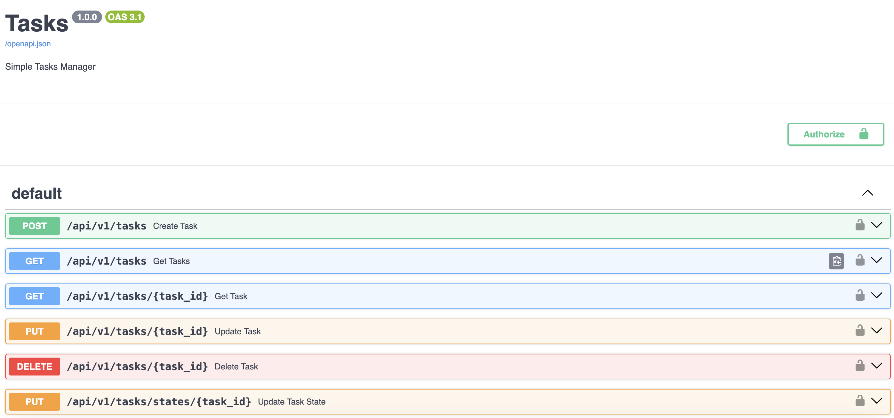

## Simple API manejador de tareas

Simple API para administrar tareas
Escrito en Python utilizando el Framework FastAPI

### Dependencias

- Python 3.10+
- PostgreSQL Client
- Docker Engine

### Configuracion de la Base de Datos

En mi caso levante una instancia de PostgreSQL versión 14.9

Vas a docker hub y descargas La imagen de Postgres de la siguiente forma

```
docker pull postgres:14.9
```

Luego levantamos una instancia de Postrgres desde docker

```
docker run --name some-postgres -e POSTGRES_HOST_AUTH_METHOD=trust -p 5432:5432 -d postgres:14.9
```

Luego creamos la base de datos tasks conectandonos al contenedor docker usando postgres client (Si tienes un administrador grafico como PgAdmin genial)

```
psql -h 127.0.0.1 -p 5432 -U postgres
```

Una ves en la cli de Postgres creamos la base de datos y nos desconectamos del motor Postgres

```
create database tasks;
\q
```

### Configuracion de la APP FastAPI

Nos descargamos la APP desde Github

```
git clone https://github.com/fenavillarroel/task_api.git
```

Luego nos movemos al directorio task_api y ejecutamos los siguientes comandos

```
cd task_api
pip install -r requirements.txt
mv env.example .env
```

Finalmente levantamos la APP ejecutando el siguiente comando

```
uvicorn app:app --reload --host 0.0.0.0
```

Si no ves ningún ya tendras la APP ejecutadose en tu localhost y podrás acceder a su documentación visitando la siguiente URL:

```
http://127.0.0.1:8000/docs
```


### Probando la API

Lo primero que se debe hacer es crear un usuario, para ello se debe usar el endpoint Create User


Luego para consumir los distintos endpoints de tareas te debes autentificar con el usuario recien creado.

Existen dos alternativas para ello:

La primera es usar el endpoint Auth, pasandole solo el username y password


Luego si deseas consumir la API desde un cliente externo y luego de haber consumido el endpoint Auth este te retornará el token con el que puedes consumir la API usando CURL u otro cliente como Postman


La segunda alternativa es haciendo click sobre cualquiera de los candados que aparecen en el costado derecho como abiertos lo que desplegara un formulario para que ingreses tu usuario y contraseña recien creados




Y eso es todo ya puedes consumir la API Tareas.

Se proporciona un Dockerfile en caso que necesites hacer un despligue en un cluster de Kubernetes.